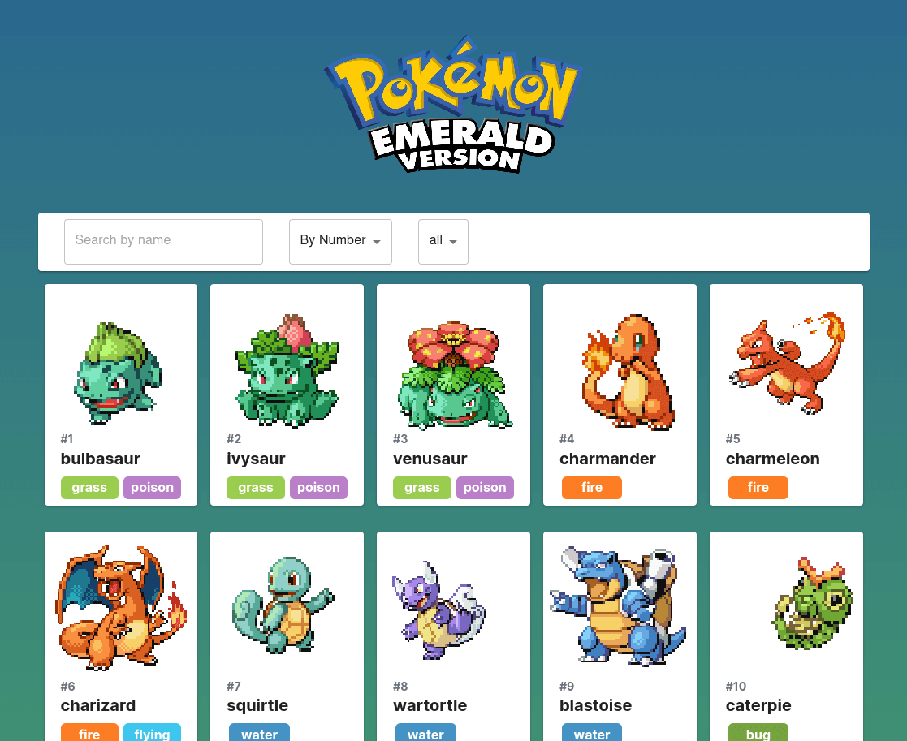

<p align="center" float="left">
    
</p>

## Description

Pokemon Emerald Webapp

## Links

[](https://pokemon-emerald-webapp.asciicrawler.com/)

[](https://github.com/AsciiCrawler/pokemon-emerald-webapp-frontend)

[](https://github.com/AsciiCrawler/pokemon-emerald-webapp-backend)

## Tech stack


## Getting Started

First, run the development server:

```bash
npm run dev
```

Open [http://localhost:3000](http://localhost:3000) with your browser to see the result.

## Stay in touch

[](https://www.linkedin.com/in/alfredotorresvelarde/)

[
](https://twitter.com/AsciiCrawler)

[
](https://asciicrawler.com)


## License

This project is [MIT licensed](LICENSE).
